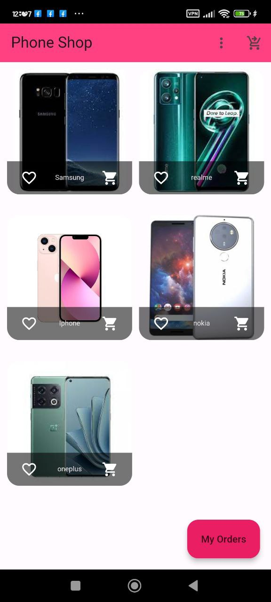

# shop_app

Small Shop App for shopping and displaying products.

## Features
- **display product:** display full and complete information for the product.
- **favorite:** Add products to the favorite section.
- **Card:** Show the full information about your card.

## Technologies Used
- **Dart:** The programming language used for Flutter.
- **Flutter:** For building the mobile app.
- **Provider:** For State Managment.

## Screens

  
  
  
  

